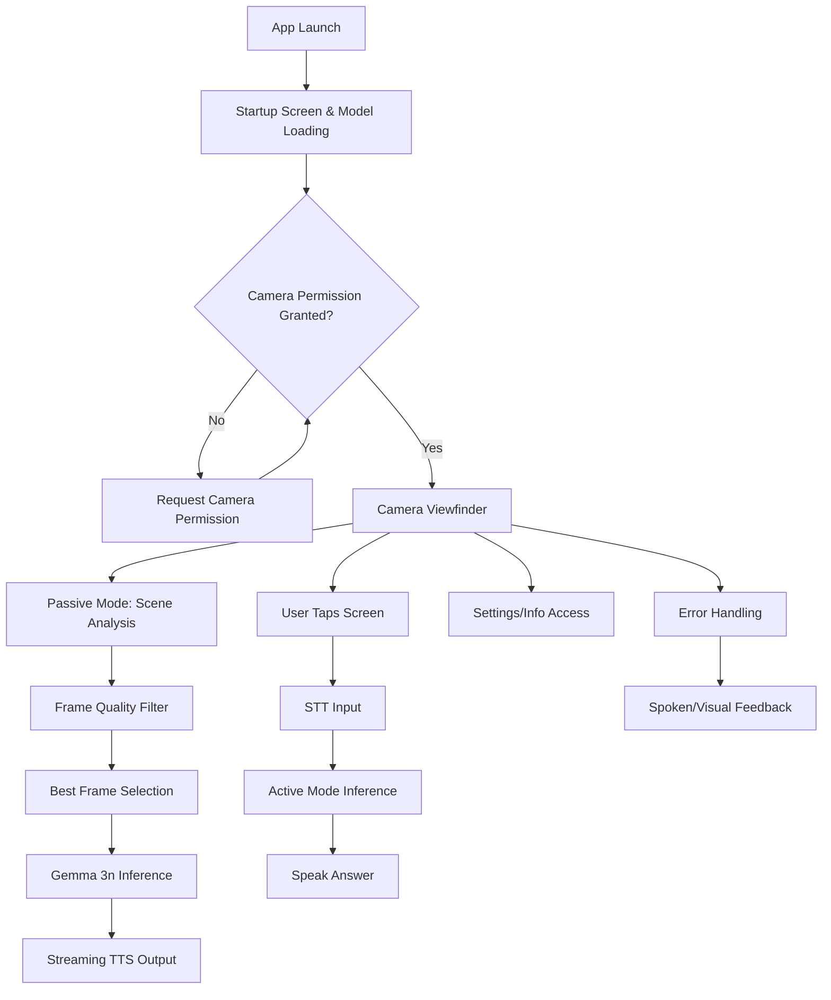

## Installation & Setup

### Requirements

- **iOS 15.0+**
- **Xcode 14.0+**
- **CocoaPods**
- **Real iOS device** (required for camera and TTS functionality)

### Steps

1. **Clone the repository:**
   ```bash
   git clone https://github.com/chetanreddyv/gemmai-ios.git
   cd gemmai-ios
   ```

2. **Install dependencies:**
   ```bash
   pod install
   ```

3. **Open the workspace in Xcode:**
   ```bash
   open GemmA.I.xcworkspace
   ```

4. **Download the Gemma 3N 2B model:**
   - Download `gemma-3n-E2B-it-int4.task` from [HuggingFace](https://huggingface.co/google/gemma-3n-E2B-it-litert-preview/tree/main)
   - Place the file in the `GemmA/` folder
   - **Note:** This file is ~2.9GB and is excluded from the repository

5. **Build and run** on your iOS device (real device required for camera and TTS)

---

# GemmA.I – On-Device Vision Assistance for the Blind

## Overview

**GemmA.I** is an iOS app designed for and with the blind and visually impaired community, delivering real-time scene understanding and spoken assistance **with 100% local, on-device processing**. Your camera data, questions, and results **never leave your device**: there is **no cloud, no internet required, and no compromise on privacy**. Built with accessibility at its core, GemmA.I empowers users to navigate the world independently, securely, and confidently anywhere, anytime.

- **Runs entirely on CPU:** No GPU or special hardware required works on a wide range of iOS devices.
- **4-bit quantized models:** Efficient, fast, and optimized for edge/on-device AI.
- **Real-time performance:** Sub-second spoken feedback with optimized inference pipeline.

---

## Why GemmA.I?

- **Privacy by Design:** All vision and language AI runs entirely on your device. No images, audio, or personal data ever leave your phone.
- **No Internet Needed:** Works anywhere on the street, in the subway, or off the grid. No WiFi, no mobile data, no cloud.
- **Accessible for All:** Built for the blind and visually impaired, with VoiceOver support, clear audio feedback, and a simple, intuitive interface.
- **Community-Driven:** Developed with feedback from the blind/VI community to ensure real-world usability and impact.
- **Performance Optimized:** Achieves 2.2-2.3 tokens/sec inference throughput with 4.5-5.6 second first token latency.

---

## Features & User Flow

- **Premium Startup Screen:** Bold branding, animated loading, and privacy-first messaging.
- **Camera View:** Live camera feed with a clear, accessible UI.
- **Tap-to-Ask:** Tap anywhere on the screen to ask a question about your surroundings.
- **Spoken Feedback:** Instant, streaming audio responses for hazards, obstacles, and user questions.
- **Passive & Active Modes:** Passive mode for continuous scene analysis; active mode for user-initiated questions.
- **Accessibility:** Full VoiceOver support, high-contrast text, and large touch targets.
- **Settings:** Simple settings for model info and app details.
- **Robust Error Handling:** Clear spoken and visual feedback for errors or issues.

### Typical User Flow
1. **Launch the App:**
   - See the startup screen with "GemmA.I" branding and loading animation.
   - The app loads the on-device model and initializes the camera.
2. **Grant Camera Permission:**
   - If not already granted, the app requests camera access.
3. **Camera View Appears:**
   - The live camera feed is displayed.
   - A hint below the viewfinder reads: _"Tap anywhere on screen to ask a question"_.
   - The top status bar shows vision status, session state, and mode.
4. **Passive Mode (Default):**
   - The app continuously analyzes the scene and provides spoken alerts for hazards or obstacles.
   - All processing is local and private.
5. **Ask a Question:**
   - Tap anywhere on the screen.
   - The app listens for your spoken question (with clear audio/visual cues).
   - The app analyzes the current scene and your question, then speaks the answer.
6. **Accessibility:**
   - All actions are accessible via VoiceOver.
   - Spoken feedback and large, readable text ensure usability for all.
7. **Settings & Info:**
   - Access settings for model info and app details.
8. **Error Handling:**
   - If any error occurs (e.g., camera unavailable, model not loaded), the app provides clear spoken and visual feedback, and guides the user to resolve the issue.

---

## Technical Architecture

### System Overview
GemmA.I employs a sophisticated real-time vision processing pipeline optimized for on-device inference:

- **CameraManager**: Captures high-resolution frames at 10 FPS using AVFoundation
- **Vision Model (Gemma 3n VLM)**: Performs on-device vision-text inference with 4-bit quantized INT4 model via MediaPipe
- **Frame Quality Filter**: Evaluates frame sharpness (Laplacian variance), brightness, and perceptual hashing
- **State Manager & UI Overlay**: Manages passive/active modes, buffering, and scene-change detection
- **Speech Interface**: Streaming TTS with chunked AVSpeechSynthesizer and continuous STT using SFSpeechRecognizer
- **UI Layer (SwiftUI)**: Displays camera preview with full accessibility support

### Application Flow

**Passive Mode:**
```
Camera Feed → Frame Quality Evaluation → Best Frame Selection → Gemma 3n Inference → Streaming Output → TTS + UI Overlays
```

**Active Mode:**
```
User Tap → Microphone Input (STT) + Frame Capture → Multimodal Prompt → Gemma 3n Inference → Streaming Results → TTS + UI
```

### Performance Metrics

| Metric | Performance |
|--------|-------------|
| First Token Latency | 4.5–5.6 seconds |
| Total Inference Time | 5.6–9.1 seconds |
| Inference Throughput | 2.2–2.3 tokens/sec |
| Frame Rate | Stable at 10 FPS |
| Memory Usage | Optimized, Efficient |

### Performance Improvements

| Metric | Before Optimization | After Optimization |
|--------|-------------------|-------------------|
| First Token Latency | 9+ seconds | 4.5–5.6 seconds |
| Total Inference Time | Not measured | 5.6–9.1 seconds |
| Inference Throughput | 1.1 tokens/sec | 2.2–2.3 tokens/sec |
| Memory Usage | High | Optimized, Efficient |
| Frame Rate Consistency | Variable | Stable at 10 FPS |

### Technical Optimizations

#### 1. Frame Quality Management
- **Laplacian Variance**: Discards frames with variance ≤10 (blurry detection)
- **Brightness Filter**: Rejects frames with brightness ≤0.15 (underexposed)
- **Perceptual Hashing**: Uses 64-bit perceptual hash with Hamming distance ≥10 for scene-change detection
- **Fast Hashing**: 16×16 fast hash for redundancy filtering

#### 2. Sliding Buffer Strategy
- **Buffer Size**: 4 frames for batch quality selection
- **Selection Frequency**: Every 1 second in passive mode
- **"Latest Frame Wins"**: No backlog, minimizes delay for fresh input

#### 3. Token Management System
- **Fixed Allocation**: 256 tokens per image, ~100 tokens for text I/O
- **Total Budget**: 400 tokens per inference (with 44 token buffer)
- **Reset Strategy**: Reset after 4 inferences (5th inference after reset) to prevent overflow
- **Safe Reset**: Never during active processing, automatic fallback on limit hit
- **Simple Counting**: No complex token estimation - just count inferences (5 total: 4 before reset + 1 after reset)

#### 4. Model Configuration
```swift
topK: 20          // Deterministic, focused responses for safety
topP: 0.8          // Restrictive output distribution
temperature: 0.5   // Conservative randomness for reliability
randomSeed: 101    // Reproducible outputs
maxTokens: 2048    // Context window for extensibility
```

**Configuration Reasoning:**
- **topK (0.5)**: Lower values produce more deterministic, focused responses ideal for safety-critical blind navigation
- **topP (0.8)**: Restrictive output distribution focused on high-probability tokens for consistent instructions
- **temperature (0.5)**: Conservative value reducing creative drift, ensuring reliable warnings and alerts
- **randomSeed (101)**: Fixed seed ensures reproducibility for demos, QA, and safety validation
- **maxTokens (2048)**: High context window for future extensibility while maintaining real-time speed

### Prompt Engineering

**Passive Mode Prompt:**
- 6-word limit for low TTS latency
- Prioritized hazard hierarchy: moving > ground > head-level > navigation
- Standardized format: "CAUTION [hazard] [direction]" or "CLEAR"
- No explanations to maintain focus on navigation

**Active Mode Prompt:**
- Open-ended question answering
- Encourages brevity and clarity
- Navigation assistance relevance

---

## The Challenge: Building for Real-World Impact

### Mission & Vision
GemmA.I was created to demonstrate how a private, offline-first, multimodal AI model like Gemma 3n can make a tangible difference in people's lives. Our mission: **empower the blind and visually impaired community with real-time, accessible, and private scene understanding anywhere, anytime, with no internet required.**

But the vision is bigger: Gemma 3n enables a new generation of apps that protect privacy, work reliably offline, and serve real needs in accessibility, education, health, crisis response, and beyond.

### Why Accessibility?
Globally, over 285 million people live with visual impairments that significantly hinder their ability to navigate independently. Most AI vision tools require cloud connectivity, risking privacy and failing in low-connectivity areas. GemmA.I proves that with edge AI, you can deliver:
- **Instant spoken scene descriptions and hazard alerts**
- **Tap-to-ask questions about the environment**
- **All with zero data ever leaving the device**

### Technical Architecture & Innovations
- **Gemma 3n LLM (2B, 4-bit quantized, CPU-only):** Runs entirely on-device, no GPU or cloud needed
- **CameraManager:** Captures and buffers frames, selects the sharpest/brightest for analysis
- **VisionProcessor:** Feeds images and prompts to the LLM for multimodal understanding
- **SpeechManager:** Streams spoken feedback as soon as results are available
- **SwiftUI UI:** Simple, accessible, and high-contrast for blind/VI users
- **Robust error handling:** Recovers from camera/model issues, always provides feedback

### Challenges Overcome
- **On-device quantization:** Running a large vision-language model in 4-bit on CPU, with minimal RAM/compute
- **Real-time performance:** Achieving sub-second spoken feedback on mobile hardware
- **Accessibility:** Designing for non-visual interaction, VoiceOver, and clear audio cues
- **Privacy:** Ensuring no data ever leaves the device, even for speech or vision
- **User experience:** Making the app intuitive, reliable, and stress-free for users with different abilities

### Why These Choices Matter
- **Privacy-first:** No cloud, no leaks users can trust the app with their most sensitive moments
- **Offline reliability:** Works in subways, rural areas, or anywhere connectivity is poor
- **Inclusivity:** Designed for and with the blind/VI community, but the architecture can serve many more
- **Viral potential:** The same approach can power education, health, crisis response, and sustainability apps anywhere privacy and offline use matter

### Inspiring the Next Generation
GemmA.I is just the beginning. Imagine:
- **Education:** Interactive, offline learning for students in low-connectivity regions
- **Health:** On-device wellness or mental health support, with no data sent to the cloud
- **Crisis Response:** Tools that provide critical info or translation when networks are down
- **Sustainability:** Apps that identify plants, track biodiversity, or promote recycling privately, on-device


---

## Technical Implementation

### Core Components

#### CameraManager.swift
- Manages AVCaptureSession with 10 FPS frame capture
- Performs frame normalization for upright orientation
- Runs session management asynchronously for thread safety
- Delivers valid frames through delegate callbacks

#### VisionAssistanceViewModel.swift
- Maintains ring buffer of 4 frames with quality metrics
- Applies sharpness and brightness thresholds
- Implements scene-change detection via perceptual hashing
- Uses "latest frame wins" policy to avoid model overload

#### VisionProcessor.swift
- Loads Gemma 3n E2B INT4 quantized model via MediaPipe
- Center-crops images to square format
- Supports dynamic model scaling (2B to 4B parameters)
- Streams partial tokens for real-time TTS feedback
- Uses `generateAsyncResponse` for optimal performance (vs `generateResponse`)
- Implements session reuse to avoid creating new sessions for each inference

#### SpeechManager.swift
- Implements chunked TTS with 100ms phrase-based batches
- Uses AVAudioSession with .duckOthers for audio coexistence
- Live STT with SFSpeechAudioBufferRecognitionRequest
- Manages audio session and fallback voice options

#### VisionAssistanceView.swift
- SwiftUI interface with real-time camera preview
- Status HUD showing mode, FPS, and errors
- Large hit area for tap-and-hold gesture activation
- Full VoiceOver support with semantic labeling

### Error Handling & Robustness
- **Frame Filtering**: Aggressive filtering of blurry, underexposed, or duplicate frames
- **User Alerts**: Real-time notifications for camera or model errors
- **Resource Cleanup**: Robust cleanup during app lifecycle transitions
- **Modular Architecture**: Clear separation of concerns for targeted testing
- **Configurable Thresholds**: Centralized settings for different hardware environments

### Comprehensive Problem Solutions

| Problem | Solution / Improvement |
|---------|----------------------|
| Model latency | 4-bit quantization, frame buffer and selection, CoreML delegate acceleration |
| Token overflow | Context reset before inference, minimized prompt length, batch processing |
| Inference and output lag | Streaming output with chunked TTS to reduce perceived latency |
| Redundant or unclear output | Word-difference and phrase filters, suppressed filler outputs |
| UI lag | Separate threads for inference, UI rendering, and speech synthesis |
| Permission errors | Strengthened camera and audio session management |
| Race conditions and deadlocks | Single-threaded inference, robust queuing, modularized state |
| Model inference stability | E2B INT4 quantized variant with MediaPipe Tasks |
| App backgrounding crashes | Comprehensive lifecycle management for suspend/resume |
| Performance bottlenecks | Session reuse, extensive logging for analysis |

### Performance Optimizations
- **Session Reuse**: Leverages existing sessions for faster inference
- **Streaming Output**: Chunked TTS reduces perceived latency
- **Context Management**: Strict context reset prevents token overflow
- **Thread Safety**: Separate threads for inference, UI rendering, and speech synthesis
- **Inference Method**: Uses `generateAsyncResponse` for better performance (vs `generateResponse`)
- **Pre-warming**: Model, TTS, and STT engines are pre-warmed at startup for better performance
- **Session Management**: Reuses existing sessions instead of creating new ones for each inference

---

## Troubleshooting

- **Model fails to load**: Ensure `gemma-3n-E2B-it-int4.task` is in the `GemmA/` folder.
- **No camera feed**: Grant camera permissions in iOS settings.
- **No speech output**: Ensure device is not muted and TTS is enabled.
- **App crashes on launch**: Check iOS version and device compatibility.
- **Slow inference**: Verify model file integrity and device performance.
- **Token limit errors**: Automatic retry with session reset should resolve this.

---

## Future Scope

- **Fine-tuned Gemma 3n**: Supervised fine-tuning with custom dataset for expert model
- **1.58-bit Quantization**: {-1, 0, 1} weights for instant real-time use on tiny devices
- **Parallel/Hybrid Modes**: Running passive and active queries in parallel for maximum safety
- **Enhanced Accessibility**: Advanced VoiceOver integration and haptic feedback
- **Multi-language Support**: Localized prompts and TTS for global accessibility

---

## License

[MIT License](LICENSE)

---

## Acknowledgements

- Google's MediaPipe team for on-device LLM tools
- The Gemma model team for the open-source LLM
- Apple for AVFoundation and accessibility APIs
- The blind and visually impaired community for resources and inspiration

---

## System Flow Diagram


